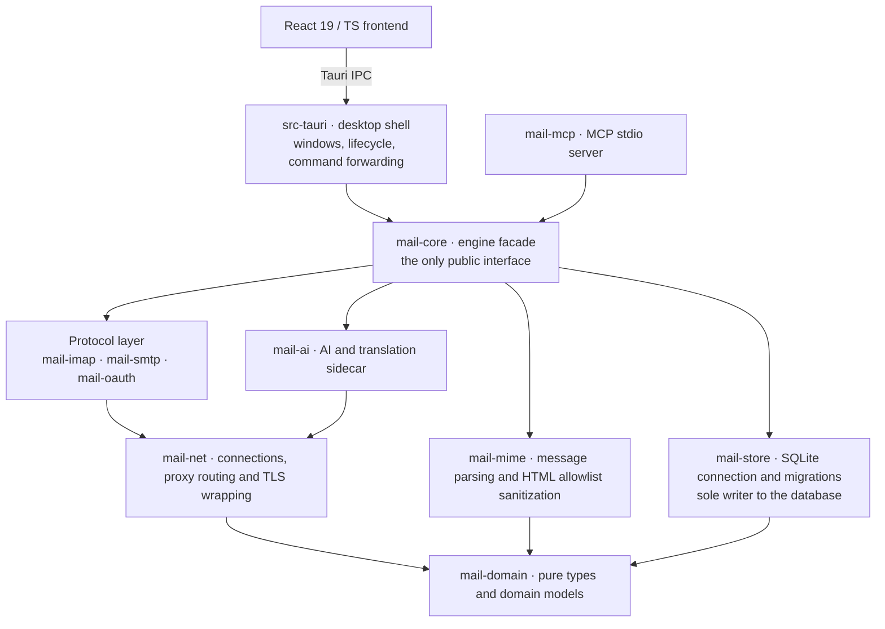

<div align="center">


# Y-Mail

**A free, open-source, local-first unified inbox for all your mailboxes**

_163, QQ, WeCom, Gmail, Outlook — all in one inbox_

[](https://github.com/yueTc/Y-Mail/releases/latest)
[](https://github.com/yueTc/Y-Mail/actions/workflows/ci.yml)
[](LICENSE)
[](#installation)
[](src-tauri)
[](crates)
[](src)
[](crates/mail-store)
[](https://github.com/yueTc/Y-Mail/stargazers)

[**User Guide**](docs/user-guide.md) · [**Security Audit**](docs/security-audit.md) · [**Download**](https://github.com/yueTc/Y-Mail/releases/latest) · [**Feedback**](https://github.com/yueTc/Y-Mail/issues)

**English** | [简体中文](README.zh-CN.md)

</div>

---

> Current version `0.1.2`. Product name `Y-Mail`, bundle identifier `com.ymail.desktop`.

## Highlights

- **Local-first** — syncing, searching, reading and attachments all happen on your machine; the app has no telemetry and reports nothing
- **Many accounts, one inbox** — 163 / QQ / WeCom sign in with an app password, Gmail / Outlook use OAuth2 (PKCE + loopback callback), and everything merges into a single view
- **A layered Rust engine** — ten crates with one-way, acyclic dependencies; `mail-domain` sits at the bottom and the protocol and storage layers never see each other
- **Full-text search** — a local SQLite FTS5 index with substring matching for Chinese, plus `from:` / `has:attachment` / `is:unread` / `before:`
- **Safe by default** — HTML is allowlist-sanitized and rendered in a sandbox, remote images are blocked, and secrets only ever go to Windows Credential Manager
- **AI and MCP are off by default** — AI asks for confirmation before every outbound call and can be disabled in one click; MCP is read-only by default and speaks local stdio only, listening on no port; both leave a local audit trail
- **Desktop integration** — tray residency, single instance, silent launch at startup, and a mail data directory you choose yourself

## Features

| Area | What you get |
|---|---|
| **Accounts & sync** | Multiple accounts side by side — Chinese providers sign in with an app password (授权码), Gmail / Outlook use OAuth2 (tokens go straight into the OS credential vault, and plaintext auth is never a fallback) · Layered proxies: per-account > global custom > follow system > direct, configurable per account · Folder mapping, snapshot + background backfill + on-demand deep fetch, incremental sync, IMAP IDLE push (polling where unsupported), resumable fetching, automatic rebuild when UIDVALIDITY changes, backoff retries; one unreachable account never blocks the others |
| **Unified inbox** | Merged across accounts, account color tags, combined unread count, account / folder tree, virtualized scrolling and paging · Flat by default, switchable to a “group by conversation” view · Per-message red flag / starred, with a dedicated “Starred” view |
| **Reading** | Bodies lazy-loaded and cached locally · HTML allowlist sanitization + sandboxed rendering · Remote images blocked by default and loaded only when allowed for that message · Inline images (`cid:`) rendered safely · Links in the body open in your default browser · Attachments downloaded on demand with sanitized filenames · Draggable divider between body and attachments |
| **Search** | SQLite FTS5 full-text search with substring matching for Chinese · Supports `from:` / `has:attachment` / `is:unread` / `before:` · Fetches a batch of history from the network on demand when local results don’t fill a page |
| **Compose / reply / forward** | Rich-text editor (bold, color, font size, alignment, indent, line spacing, lists, tables, images, links, plus a format painter and clear-formatting) · Drafts, attachments, per-account signatures · The outbox claims each message atomically before sending so nothing is delivered twice, retries on failure, and best-effort appends to the Sent folder |
| **Contacts** | A local contacts page populated automatically from the people you mail, with no network access and no CardDAV / LDAP · “Write email” on a contact opens the composer with the recipient already filled in |
| **AI & translation** | Off by default · Works with OpenAI-compatible relays / local Ollama / DeepL, with keys going straight into the OS credential vault · Translation in **side-by-side / inline / direct** modes, all three sharing one paragraph-aligned translation so switching modes costs no extra model calls · Also summarization, polishing and AI drafting, with four levels of reasoning effort and automatic fallback when the endpoint doesn’t support them · Every outbound call shows a dialog naming the target domain / model / whether it’s local, and only sends once you confirm; settings offers one-click “disable AI” and “clear cache” |
| **MCP integration** | Off by default and read-only by default, over local stdin/stdout only — it listens on no port · With the master switch on, settings generates ready-to-paste config for Codex / Claude Desktop / Cursor (`command` pointing at `ymail-mcp.exe` in the install directory, `env.YMAIL_DATA_DIR` at the app data directory) · Read-only tools `list_accounts` / `list_folders` / `search_messages` / `get_message` / `get_thread`, plus one write tool `create_draft` (off by default; it can only create drafts, never send) · Every call is recorded in a local audit log (tool name / account scope / argument hash / status, never message bodies); “disable MCP” takes effect immediately |
| **Desktop integration** | Lives in the system tray — closing the window tucks it away and new mail raises a system notification · Single instance: launching again just brings the existing window forward, so two instances never fight over the same database · Launch at startup drops silently into the tray and keeps fetching mail in the background; the switch reflects real system state · On first launch a wizard asks where to keep mail data — the default location or a folder you pick — and it can be changed later in settings; changing it restarts the app and optionally cleans up the old directory (the settings file is kept) |
| **Appearance** | Light / dark / follow system, applied across the whole app |

## Installation

Grab the latest version from [**GitHub Releases**](https://github.com/yueTc/Y-Mail/releases/latest):

| Platform | Installer |
|---|---|
| **Windows 10 / 11 (x64)** | [`Y-Mail_0.1.2_x64_en-US.msi`](https://github.com/yueTc/Y-Mail/releases/download/v0.1.2/Y-Mail_0.1.2_x64_en-US.msi) (MSI, ~12 MB) |

So far only the Windows x64 MSI is published; an NSIS installer can be built locally with `npm run tauri build` (see [Build from source](#build-from-source) below).

### Requirements

- Windows 10 / 11 (x64) with the WebView2 runtime
- MSVC build tools (the `x86_64-pc-windows-msvc` target)
- Building from source additionally needs: Node.js 24+ and npm 11+, plus Rust stable (`rust-toolchain.toml` pins the channel and components, and `rustup` installs them on demand)

### Build from source

```powershell
npm ci                      # install frontend dependencies
npm run build               # type-check and build the frontend
npm run tauri build         # bundle (MSI / NSIS; generates the MCP sidecar for you)
npm run tauri dev           # or: run the desktop app in development mode
```

## Getting started

1. The first launch shows a wizard asking where to keep your mail data: use the default location, or pick a folder yourself (a restart applies it).
2. Go to **Settings → Accounts** and add an account. For Chinese providers, enter the address and an app password (generate one in the provider’s web mail first); Gmail / Outlook use one-click OAuth2. Hit “connection self-check” and only save once it passes.
3. Open the sync panel and sync once, then watch mail land in the unified inbox.
4. For Gmail / Outlook over OAuth2, register a desktop app with the provider and add the local loopback redirect URI; built-in client IDs work out of the box, or bring your own. See [section 4 of the user guide](docs/user-guide.md).
5. Accounts that need a proxy are configured individually under **Settings → Proxy**.

## Privacy

- Secrets go only to Windows Credential Manager; no plaintext in the database, logs or error reports.
- Syncing, searching, reading and attachments all happen locally; the app has no telemetry and reports nothing.
- Remote images in HTML mail are blocked by default and loaded only when allowed for that message.
- AI / translation are off by default and authorized per use; model output is rendered as plain text only.
- AI and MCP calls leave a local audit trail that never includes message bodies.

## Documentation

> The documents below are currently written in Chinese only.

| Document | Contents |
|---|---|
| [User Guide](docs/user-guide.md) | Installation, first-time setup, accounts and proxies, OAuth2, AI, MCP, troubleshooting |
| [Security Audit Report](docs/security-audit.md) | Point-by-point conclusions, evidence and unverified areas for each security rule |
| [Manual Acceptance Checklist](docs/manual-acceptance-checklist.md) | Real mailboxes / real AI / tray / installer scenarios that automation can’t cover |
| [Release Checklist and Rollback Plan](docs/release-checklist.md) | Version numbers, artifact list, database backup and upgrade, uninstall and rollback |
| Design specs (`docs/superpowers/specs/`) | The unified inbox master spec (v1.2), plus sub-specs for UI polish, folders and flags, contacts, launch at startup, renaming and data-directory cleanup |

## Architecture

**One Rust engine, one desktop shell, one frontend.** Dependencies run one way and never form a cycle: `mail-domain` ← everything else; `mail-store` ← `mail-core`; the protocol layer ← `mail-core`; `mail-core` ← `src-tauri` ← frontend.



- **`mail-core` is the only facade:** the frontend and `src-tauri` reach the engine exclusively through it, and the protocol, storage and AI layers stay unaware of one another.
- **`mail-store` is the only writer:** no other crate writes SQLite directly, so there is never more than one writer.
- **`mail-domain` sits at the bottom:** pure types and domain models, depending on no other crate.

| Layer | Stack | Directory |
|---|---|---|
| Desktop shell | Tauri 2 (Rust); windows, lifecycle, command forwarding | [`src-tauri/`](src-tauri) |
| Frontend | React 19 + TypeScript + Vite | [`src/`](src) |
| Engine facade | Rust; the only public interface | [`crates/mail-core/`](crates/mail-core) |
| Protocols & storage | IMAP / SMTP / OAuth2, SQLite (FTS5) + MIME sanitization, AI sidecar off by default | [`crates/`](crates) |
| MCP server | stdio server, executable entry point `ymail-mcp` | [`crates/mail-mcp/`](crates/mail-mcp) |
| In-repo scripts | Icon generation, MCP sidecar generation, and more | [`scripts/`](scripts) |

<details>
<summary><b>Directory layout</b></summary>

```
crates/
  mail-domain/   Pure types and domain models (bottom layer, depends on no other crate)
  mail-net/      Connections, proxy routing and TLS wrapping shared by IMAP / SMTP
  mail-store/    SQLite connection and migrations; the sole writer
  mail-mime/     Message parsing and HTML allowlist sanitization
  mail-imap/     IMAP client (including connection self-check)
  mail-smtp/     SMTP client
  mail-oauth/    OAuth2 / XOAUTH2
  mail-ai/       AI and translation sidecar (off by default)
  mail-core/     Engine facade, the only public interface
  mail-mcp/      MCP stdio server (executable entry point ymail-mcp)
src-tauri/       Desktop shell: windows, lifecycle, command forwarding
src/             React/TS frontend
scripts/         In-repo helper scripts (icon generation, MCP sidecar, and more)
docs/            User guide, security audit, manual acceptance, release and rollback, design specs
```

</details>

## Development

### Common commands

```powershell
npm ci                      # install frontend dependencies
npm run build               # type-check and build the frontend
npm run tauri dev           # run the desktop app in development mode
npm run tauri build         # bundle (MSI / NSIS; generates the MCP sidecar for you)
npm run build:mcp-sidecar   # generate the MCP sidecar on its own
npm test                    # frontend tests

cargo fmt --all --check                                 # formatting check
cargo clippy --workspace --all-targets -- -D warnings   # lints (warnings are errors)
cargo test --workspace                                  # all Rust tests (including Wave 9 end-to-end acceptance)
```

Before opening a PR, make sure `npm run build`, `npm test`, `cargo fmt --all --check`, `cargo clippy --workspace --all-targets -- -D warnings` and `cargo test --workspace` all pass — that is exactly what CI runs (see [`.github/workflows/ci.yml`](.github/workflows/ci.yml)).

## Contributing

Issues and pull requests are welcome.

- **Bug reports / feature requests** — [GitHub Issues](https://github.com/yueTc/Y-Mail/issues)
- **Pull requests** — branch off `main` and target `main`
- For security reports, please read the conclusions and unverified areas already listed in the [security audit report](docs/security-audit.md) first, to avoid duplicates

## License

Distributed under the [MIT License](LICENSE). Copyright (c) 2026 yueTc.

---

<div align="center">

**If Y-Mail makes handling your mail a little easier, a star goes a long way ⭐**

Made by [yueTc](https://github.com/yueTc)

</div>
