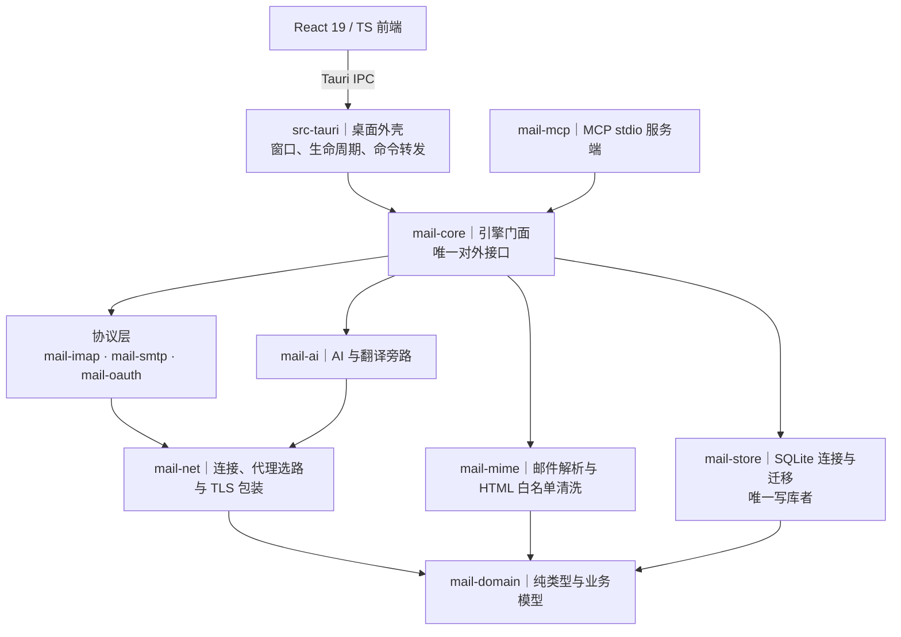

<div align="center">


# Y-Mail

**免费开源、本地优先的多邮箱统一收件箱客户端**

_163、QQ、企业微信、Gmail、Outlook —— 收进同一个收件箱_

[](https://github.com/yueTc/Y-Mail/releases/latest)
[](https://github.com/yueTc/Y-Mail/actions/workflows/ci.yml)
[](LICENSE)
[](#安装)
[](src-tauri)
[](crates)
[](src)
[](crates/mail-store)
[](https://github.com/yueTc/Y-Mail/stargazers)

[**用户手册**](docs/user-guide.md) · [**安全审计**](docs/security-audit.md) · [**下载**](https://github.com/yueTc/Y-Mail/releases/latest) · [**反馈**](https://github.com/yueTc/Y-Mail/issues)

[English](README.md) | **简体中文**

</div>

---

> 当前版本 `0.1.4`。产品名 `Y-Mail`，机器标识 `com.ymail.desktop`。

## 亮点

- **本地优先** —— 同步、检索、读信、附件都在本机完成；应用无遥测、不上报
- **多账号统一收件箱** —— 163 / QQ / 企微走授权码，Gmail / Outlook 走 OAuth2（PKCE + 本机回环回调），跨账号合并查看
- **Rust 引擎分层** —— 十个 crate 单向依赖、无环，`mail-domain` 在最底层，协议层与存储层互不感知
- **全文检索** —— SQLite FTS5 本地索引，中文按子串命中，支持 `from:` / `has:attachment` / `is:unread` / `before:`
- **安全收信** —— HTML 白名单清洗 + 沙箱渲染，远程图片默认拦截，密钥只进 Windows 凭据管理器
- **AI 与 MCP 默认关闭** —— AI 每次外发弹窗确认、可一键关闭；MCP 默认只读且只走本地 stdio，不监听端口；两者调用都在本地留审计
- **桌面集成** —— 托盘常驻、单实例、开机静默启动、数据目录可自选
- **内置签名更新** —— **设置 → 关于** 能看到当前版本、直接打开项目主页与发布页，还能检查更新、就地下载安装签名过的更新包，装完重启进新版本

## 功能特性

| 模块 | 能力 |
|---|---|
| **账号与同步** | 多账号并存，国内邮箱用「授权码」登录，Gmail / Outlook 走 OAuth2（令牌只进系统保险箱，绝不退回明文认证）· 代理分层：账号级 > 全局自定义 > 跟随系统 > 直连，按账号单独配 · 文件夹映射、快照 + 后台补齐 + 按需深拉、增量拉取、IDLE 实时收信（不支持就轮询）、断点续传、UIDVALIDITY 变化自动重建、退避重试；一个账号连不上不影响其它账号 |
| **统一收件箱** | 跨账号合并、账号色标、未读合计、账号 / 文件夹树、虚拟滚动分页 · 默认平铺，可切「按会话聚合」· 单封红旗 / 已标记，带「已标记」视图 |
| **读信** | 正文懒加载并本地缓存 · HTML 白名单清洗 + 沙箱渲染 · 远程图片默认拦截，单封放行才加载 · 内嵌图片（`cid:`）安全显示 · 正文链接用系统默认浏览器打开 · 附件按需下载、文件名消毒 · 正文框与附件栏可拖动 |
| **搜索** | SQLite FTS5 全文检索，中文按子串命中 · 支持 `from:` / `has:attachment` / `is:unread` / `before:` 四种语法 · 本地搜不满一页时按需联网补一批历史 |
| **写信 / 回复 / 转发** | 富文本编辑器（加粗、颜色、字号、对齐、缩进、行距、列表、表格、图片、链接，另有格式刷与清除格式）· 草稿、附件、每账号签名 · 发件队列发送前原子认领防重复投递，失败自动重试，发成功后尽力追加到「已发送」文件夹 |
| **通讯录** | 本地联系人页，联系人来自收发件人自动登记，不联网、不接 CardDAV / LDAP · 点某位联系人的「写邮件」直接带着收件人打开写信窗格 |
| **AI 与翻译** | 默认关闭 · 站点支持 OpenAI 兼容中转站 / 本机 Ollama / DeepL，密钥只进系统保险箱 · 翻译支持**对照 / 行内 / 直接**三种模式，三种模式共用同一份段落对齐译文，切换不重复调用模型 · 另支持摘要、润色与 AI 起草，思考程度四档，站点不支持时自动降级 · 每次外发都会弹窗写清「目标域名 / 模型 / 是否本地」，确认后才发；设置页可「一键关闭 AI」并「清空缓存」 |
| **MCP 外部接入** | 默认关闭、默认只读，只走本地标准输入输出，不监听任何端口 · 打开总开关后设置页生成给 Codex / Claude Desktop / Cursor 用的配置示例（`command` 指向安装目录里的 `ymail-mcp.exe`，`env.YMAIL_DATA_DIR` 指向应用数据目录）· 只读工具 `list_accounts` / `list_folders` / `search_messages` / `get_message` / `get_thread`，写工具仅 `create_draft`（默认关闭，只能建草稿，不能发送）· 每次调用都写本地审计（工具名 / 账号范围 / 参数哈希 / 状态，不含正文）；「关闭 MCP」一键生效 |
| **桌面集成** | 托盘常驻，关窗收进托盘，新邮件弹系统通知 · 单实例：重复启动只唤起已有窗口，不会两个实例抢同一个数据库 · 开机自动启动，勾上后开机静默进托盘，开关以系统真实状态为准 · 数据目录首次启动向导可选「用默认位置」或「自己选文件夹」，之后也能在设置里改，改完自动重启，可选顺手清理旧目录（保留设置文件） |
| **外观** | 浅色 / 深色 / 跟随系统，全站生效 |
| **关于与更新** | **设置 → 关于** 显示当前版本号（从程序本身读，不写死）· 「检查更新」读取随每次发布一起上传的更新清单，给出「已是最新」「发现新版本 + 更新说明」或明确的报错 · 「下载并安装」就地安装并显示进度，安装前用内置公钥验签，装完重启进新版本 · 一键打开项目主页与发布页 |

## 安装

从 [**GitHub Releases**](https://github.com/yueTc/Y-Mail/releases/latest) 获取最新版本：

| 平台 | 安装包 |
|---|---|
| **Windows 10 / 11（x64）** | [`Y-Mail_0.1.4_x64_en-US.msi`](https://github.com/yueTc/Y-Mail/releases/download/v0.1.4/Y-Mail_0.1.4_x64_en-US.msi)（MSI，约 12 MB） |

仓库目前只发布 Windows x64 的 MSI；NSIS 安装包可在本地用 `npm run tauri build` 生成（见下文「从源码构建」）。

### 系统要求

- Windows 10 / 11（x64），需 WebView2 运行时
- MSVC 生成工具（`x86_64-pc-windows-msvc` 目标）
- 从源码构建另需：Node.js 24+ 与 npm 11+、Rust stable（`rust-toolchain.toml` 已固定 channel 与组件，`rustup` 会自动按需安装）

### 从源码构建

```powershell
npm ci                      # 安装前端依赖
npm run build               # 前端类型检查 + 构建
npm run tauri build         # 打包（含 MSI / NSIS；会自动生成 MCP sidecar）
npm run tauri dev           # 或：启动桌面应用（开发模式）
```

> `npm run tauri build` 会同时产出更新包，因此需要 `TAURI_SIGNING_PRIVATE_KEY` 里的签名私钥；没配会报「A public key has been found, but no private key」。只想在本机试装、不打算发布时，加 `--no-sign` 跳过签名。

## 第一次使用

1. 第一次打开会弹向导，选邮件数据放哪：直接用默认位置，或自己挑一个文件夹（挑完要重启生效）。
2. 进「设置 → 账号」添加账号：国内邮箱填邮箱与授权码（授权码要先去网页版邮箱生成）；Gmail / Outlook 走 OAuth2 一键授权。填完点「连接自检」，通过再保存。
3. 打开同步面板同步一次，等邮件进统一收件箱。
4. Gmail / Outlook 若要走 OAuth2，需要在服务商后台注册桌面应用、登记本机回环回调地址；内置客户端编号可直接用，也可以填自己的。详见[用户手册第 4 节](docs/user-guide.md)。
5. 需要代理的账号，在「设置 → 代理」按账号单独配置。

## 隐私说明

- 密钥只进 Windows 凭据管理器，数据库 / 日志 / 报错里没有明文。
- 同步、搜索、读信、附件都在本机完成；应用无遥测、不上报。
- HTML 邮件里的远程图片默认拦截，单封放行才加载。
- AI / 翻译默认关闭，逐次授权；模型输出只作纯文本渲染。
- AI 与 MCP 调用都在本地留审计，不记正文原文。

## 文档

| 文档 | 内容 |
|---|---|
| [用户手册](docs/user-guide.md) | 安装、首次配置、账号与代理、OAuth2、AI、MCP、故障排查 |
| [安全审计报告](docs/security-audit.md) | 安全铁律逐条结论、证据、未验部分 |
| [人工验收清单](docs/manual-acceptance-checklist.md) | 真邮箱 / 真 AI / 托盘 / 安装器等自动化测不了的场景 |
| [发布检查清单与回滚方案](docs/release-checklist.md) | 版本号、产物清单、数据库备份与升级、卸载与回退 |
| 设计规格（`docs/superpowers/specs/`） | 统一收件箱总规格（v1.2），以及界面优化、文件夹与旗标、通讯录、开机启动、改名、数据目录清理、关于页与签名更新等子规格 |

## 架构

**一套 Rust 引擎，一个桌面外壳，一个前端。** 依赖方向单向、无环：`mail-domain` ← 其余全部；`mail-store` ← `mail-core`；协议层 ← `mail-core`；`mail-core` ← `src-tauri` ← 前端。



- **`mail-core` 是唯一门面：** 前端与 `src-tauri` 只经它访问引擎，协议层、存储层、AI 旁路互不感知。
- **`mail-store` 是唯一写库者：** 其它 crate 不直接写 SQLite，避免多个写入方。
- **`mail-domain` 在最低层：** 纯类型与业务模型，不依赖任何其它 crate。

| 层 | 技术栈 | 目录 |
|---|---|---|
| 桌面外壳 | Tauri 2（Rust）；窗口、生命周期、命令转发 | [`src-tauri/`](src-tauri) |
| 前端 | React 19 + TypeScript + Vite | [`src/`](src) |
| 引擎门面 | Rust，唯一对外接口 | [`crates/mail-core/`](crates/mail-core) |
| 协议与存储 | IMAP / SMTP / OAuth2、SQLite(FTS5) + MIME 清洗、AI 旁路默认关闭 | [`crates/`](crates) |
| MCP 服务端 | stdio 服务端，可执行入口 `ymail-mcp` | [`crates/mail-mcp/`](crates/mail-mcp) |
| 仓库内脚本 | 图标生成、MCP sidecar 生成等 | [`scripts/`](scripts) |

<details>
<summary><b>目录结构</b></summary>

```
crates/
  mail-domain/   纯类型与业务模型（最底层，不依赖任何其它 crate）
  mail-net/      IMAP / SMTP 共用的连接、代理选路与 TLS 包装
  mail-store/    SQLite 连接与迁移；唯一写库者
  mail-mime/     邮件解析与 HTML 白名单清洗
  mail-imap/     IMAP 客户端（含连接自检）
  mail-smtp/     SMTP 客户端
  mail-oauth/    OAuth2 / XOAUTH2
  mail-ai/       AI 与翻译旁路（默认关闭）
  mail-core/     引擎门面，唯一对外接口
  mail-mcp/      MCP stdio 服务端（可执行入口 ymail-mcp）
src-tauri/       桌面外壳：窗口、生命周期、命令转发
src/             React/TS 前端
scripts/         仓库内辅助脚本（图标生成、MCP sidecar 生成等）
docs/            用户手册、安全审计、人工验收、发布与回滚、设计规格
```

</details>

## 开发

### 常用命令

```powershell
npm ci                      # 安装前端依赖
npm run build               # 前端类型检查 + 构建
npm run tauri dev           # 启动桌面应用（开发模式）
npm run tauri build         # 打包（含 MSI / NSIS；会自动生成 MCP sidecar）
npm run build:mcp-sidecar   # 单独生成 MCP sidecar
npm test                    # 前端测试

cargo fmt --all --check                                 # 格式检查
cargo clippy --workspace --all-targets -- -D warnings   # 静态检查（警告视为错误）
cargo test --workspace                                  # 全部 Rust 测试（含 Wave 9 端到端验收）
```

提交前请确保 `npm run build`、`npm test`、`cargo fmt --all --check`、`cargo clippy --workspace --all-targets -- -D warnings`、`cargo test --workspace` 全部通过——CI 跑的就是这几条（见 [`.github/workflows/ci.yml`](.github/workflows/ci.yml)）。

## 参与贡献

欢迎提交 Issue 与 Pull Request。

- **Bug 反馈 / 功能建议** —— [GitHub Issues](https://github.com/yueTc/Y-Mail/issues)
- **提交 PR** —— 从 `main` 拉分支，把 PR 提到 `main`
- 涉及安全问题的报告，请先看[安全审计报告](docs/security-audit.md)里已列出的结论与未验部分，避免重复

## 许可证

基于 [MIT License](LICENSE) 分发。Copyright (c) 2026 yueTc。

---

<div align="center">

**如果 Y-Mail 让收信这件事省心了一点，欢迎点个 Star ⭐**

Made by [yueTc](https://github.com/yueTc)

</div>
